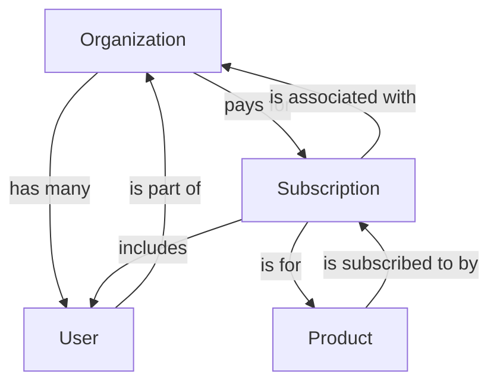

# Organization Management App

This project is a full-stack application for managing organizations, users, products, and subscriptions. The backend is built with Golang using Gin and GORM, and the frontend is a React application.

## Table of Contents

- [Features](#features)
- [Project Structure](#project-structure)
- [Setup Instructions](#setup-instructions)
- [API Endpoints](#api-endpoints)
- [Mermaid Diagram](#mermaid-diagram)

## Features

- Organization management
- User management
- Product management
- Subscription management
- Stripe integration for payments

## Project Structure

```
organization-management-app/
├── backend/
│   ├── main.go
│   ├── go.mod
│   ├── go.sum
│   ├── config/
│   │   └── config.go
│   ├── controllers/
│   │   ├── organization_controller.go
│   │   ├── subscription_controller.go
│   │   ├── user_controller.go
│   │   └── product_controller.go
│   ├── models/
│   │   ├── organization.go
│   │   ├── subscription.go
│   │   ├── user.go
│   │   └── product.go
│   ├── routes/
│   │   ├── organization_routes.go
│   │   ├── subscription_routes.go
│   │   ├── user_routes.go
│   │   └── product_routes.go
│   ├── middlewares/
│   │   └── auth_middleware.go
│   ├── services/
│   │   └── email_service.go
│   └── utils/
│       └── token_utils.go
├── frontend/
│   ├── build/
│   ├── public/
│   │   ├── index.html
│   │   └── favicon.ico
│   ├── src/
│   │   ├── components/
│   │   │   ├── InviteUser.js
│   │   │   ├── MagicLink.js
│   │   │   ├── Navigation.js
│   │   │   ├── Navigation.css
│   │   │   ├── Organizations.js
│   │   │   ├── Products.js
│   │   │   ├── Subscriptions.js
│   │   │   ├── Users.js
│   │   │   └── SubscribeProduct.js
│   │   ├── App.js
│   │   ├── index.js
│   │   ├── api.js
│   │   └── styles.css
│   ├── package.json
│   ├── README.md
│   └── .gitignore
└── README.md
```

## Setup Instructions

### Backend

1. Navigate to the backend directory:
   ```sh
   cd backend
   ```

2. Install dependencies:
   ```sh
   go mod tidy
   ```

3. Run the application:
   ```sh
   go run main.go
   ```

### Frontend

1. Navigate to the frontend directory:
   ```sh
   cd frontend
   ```

2. Install dependencies:
   ```sh
   npm install
   ```

3. Start the development server:
   ```sh
   npm start
   ```

4. Build the production build:
   ```sh
   npm run build
   ```

## API Endpoints

- **Organization Endpoints**:
  - `POST /api/organizations`: Create a new organization
  - `GET /api/organizations`: Get all organizations

- **User Endpoints**:
  - `POST /api/users`: Create a new user
  - `GET /api/users`: Get all users

- **Product Endpoints**:
  - `POST /api/products`: Create a new product
  - `GET /api/products`: Get all products

- **Subscription Endpoints**:
  - `POST /api/subscriptions`: Create a new subscription
  - `GET /api/subscriptions`: Get all subscriptions
  - `POST /api/check-subscription`: Check subscription validity

## Mermaid Diagram



## License

This project is licensed under the MIT License.
